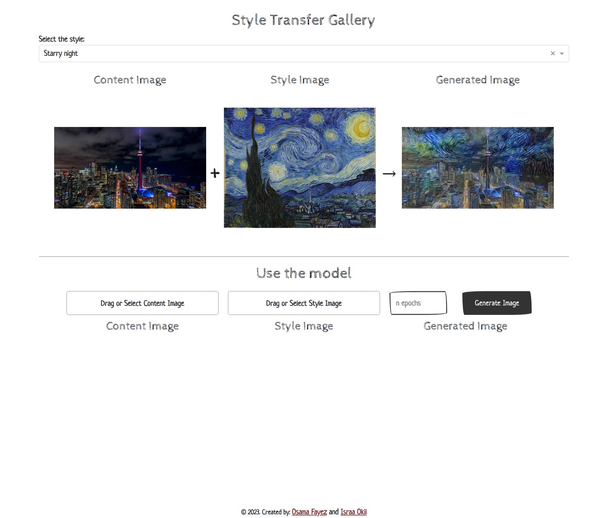
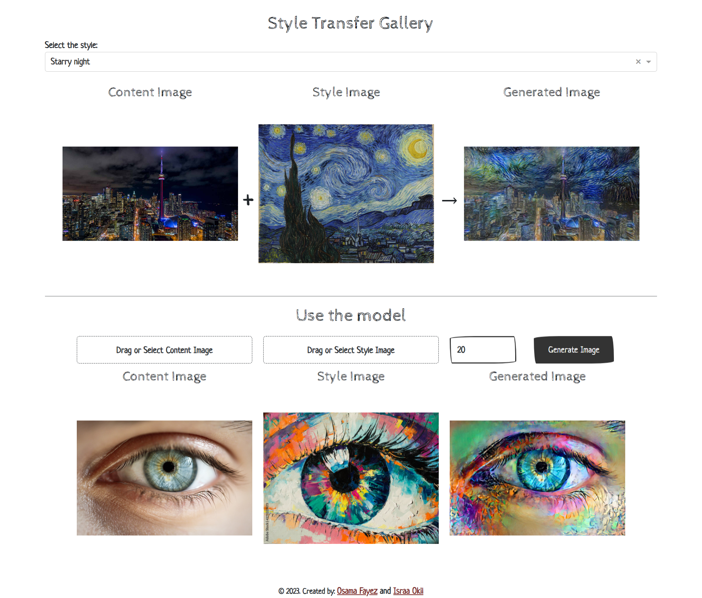

# Neural Style Transfer Project

This repository provides a TensorFlow-based implementation of Neural Style Transfer, along with a web interface built using Plotly-Dash.

Neural Style Transfer is a technique that allows you to apply the artistic style of one image to the content of another image, creating visually appealing and artistic results.

## Introduction
Neural Style Transfer combines the content of one image with the style of another image using deep neural networks. This implementation uses the VGG19 model pre-trained on the ImageNet dataset to extract content and style features from the input images. The content loss and style loss are then computed and used to optimize a target image that balances both content and style.

The web interface built with Plotly Dash provides a user-friendly way to apply Neural Style Transfer without the need for any coding. It allows users to upload their own content and style images, choose number of epochs, and visualize the generated stylized image.

Here's a high-level overview of how neural style transfer is done:

1. Preprocessing: The content and style images are preprocessed to ensure they have the same dimensions and are in a suitable format for the neural network. This involves resizing the images and normalizing the pixel values.

2. Selecting Layers: A pre-trained CNN VGGNet19 which is used as a feature extractor. Intermediate layers of the network are chosen to capture the content and style information. Typically, lower layers are used for capturing content, while higher layers are used for style.

3. Computing Content Loss: The content loss measures the difference between the feature representations of the generated image and the content image in the chosen content layers. The goal is to minimize this loss, so that the generated image preserves the content of the content image.

4. Computing Style Loss: The style loss is calculated by comparing the Gram matrices of the feature representations from the generated image and the style image in the chosen style layers. The Gram matrix captures the correlations between different features. By minimizing the style loss, the generated image adopts the style characteristics of the style image.

5. Computing Total Variation Loss: The total variation loss promotes spatial smoothness in the output image by penalizing rapid changes in pixel values. It helps to reduce artifacts and maintain visual coherence in the generated image

5. Total Loss: The total loss is a combination of the content loss and the style loss, weighted by hyperparameters along with total Variation Loss. By minimizing the total loss, the algorithm aims to generate an image that both preserves the content and exhibits the style of the input images.

6. Optimization: The generated image is initialized with random noise and iteratively updated to minimize the total loss using an optimization algorithm, such as gradient descent. The gradients of the loss with respect to the generated image are computed, and the pixel values are adjusted accordingly. This process continues for a certain number of iterations or until convergence.

7. Postprocessing: Once the optimization is complete, the generated image is postprocessed to rescale the pixel values and remove any artifacts introduced during the optimization process.

By combining the content and style information from two different images, neural style transfer allows for the creation of visually appealing and unique images that blend the content of one image with the artistic style of another.

Here is how the interface looks like:

